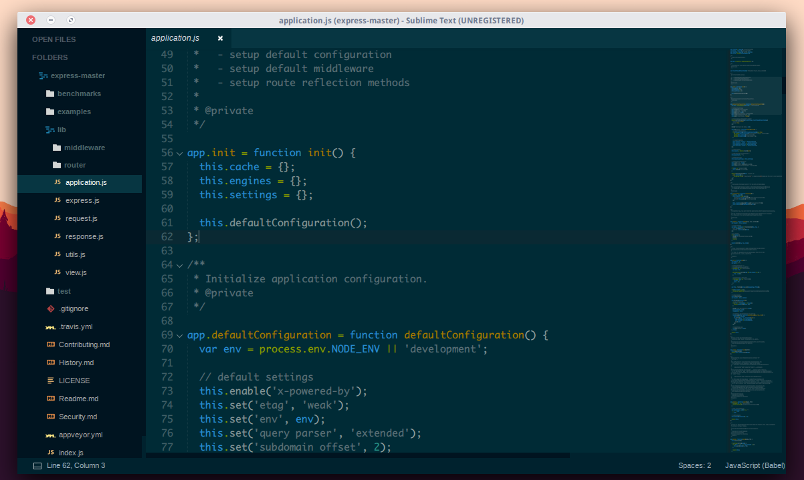

Sunrise Theme
================
This theme brings minimal Solarized UI and is based on Seti_UI theme. If you problems report with new one.

Screenshot
--------------



Manual installation
-----------------------
1. Download the latest release, extract and rename the directory to "Sunrise Theme".

2. Move the directory inside your sublime Packages directory. (Preferences > Browse packages...)

Activate the theme
------------------------------
Activate the theme with the following preferences at (Preferences > Setting - User):


```
"theme": "Sunrise.sublime-theme",
"color_scheme":"Packages/Sunrise Theme/Scheme/Sunrise.tmTheme",
```


Note : Restart Sublime Text after activating the theme.

Other available theme options
------------------------------
```
"sunrise_sidebar_small_padding": true, // Set small padding for entries in sidebar
"sunrise_sidebar_big_padding"  : true, // Set big padding for entries in sidebar
"sunrise_tabs_font_small"      : true, // Set small font for tab
"sunrise_tabs_font_normal"     : true, // Set normal font for tab
"sunrise_tabs_font_large"      : true, // Set big font for tab
```
